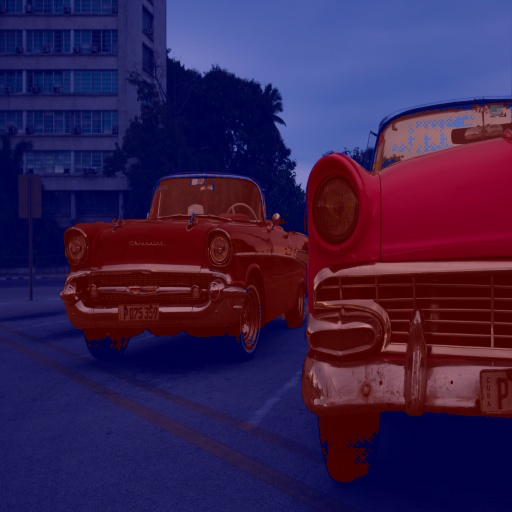
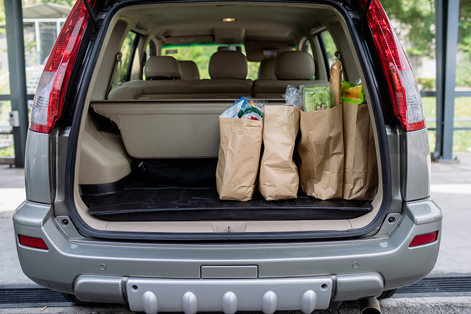
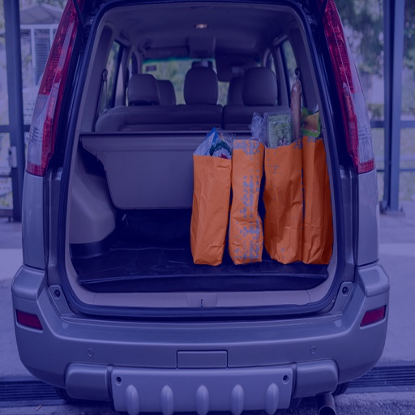
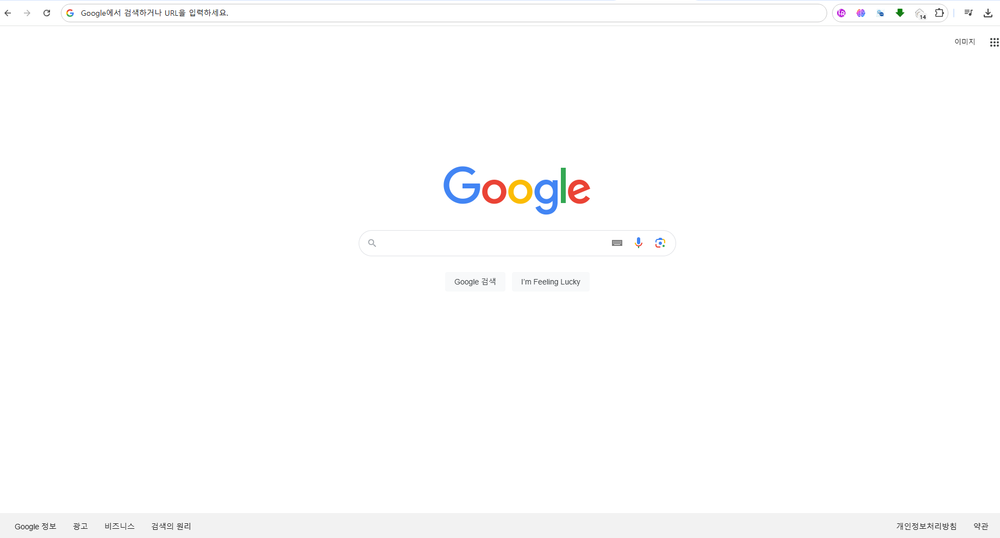
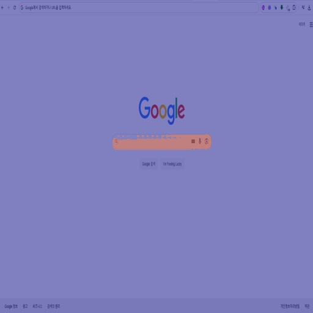
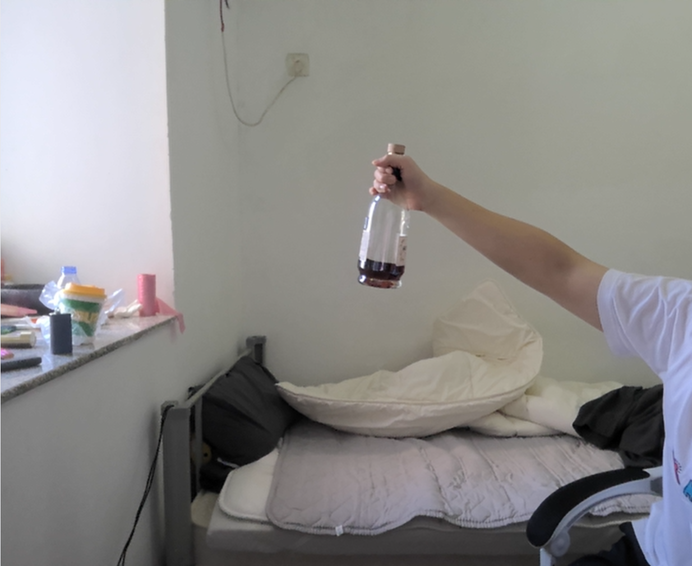
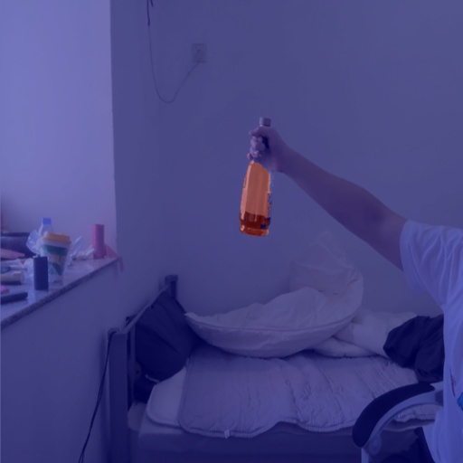
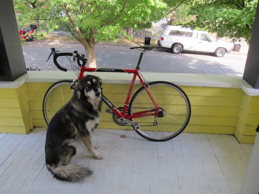
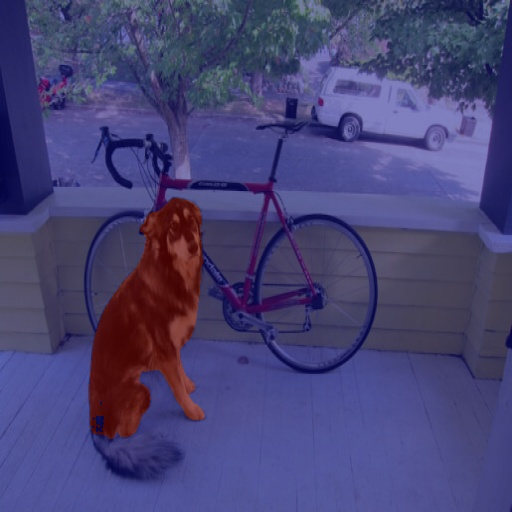

추가 내용을 반영한 README는 아래와 같습니다:

---

# Image Segmentation with Multiple Vision-Language Models

This project implements image segmentation using multiple vision-language models (Qwen2-VL, LLaVA-Next, GPT-4V) combined with SAM2. It provides interfaces for processing both static images and real-time webcam feeds.

### Links
[](https://arxiv.org/abs/2412.02565)

---

## Features

- **Support for multiple vision-language models:**
  - Qwen2-VL
  - LLaVA-Next
  - GPT-4V (via API)
- **Integration with SAM2 for precise segmentation**
- **Multiple interfaces:**
  - Static image processing
  - Folder batch processing
  - Real-time webcam segmentation
- **Memory-optimized implementation**

---

## Example Results

### Cars Detection
**Prompt**: "segment all cars in this image"
| Input | Output |
|:--------:|:---------:|
|  |  |

### Object Detection in Store
**Prompt**: "segment groceries items and products on the shelves"
| Input | Output |
|:--------:|:---------:|
|  |  |

### Logo Detection
**Prompt**: "segment the Google logo"
| Input | Output |
|:--------:|:---------:|
|  |  |

### Product Detection
**Prompt**: "segment the cognac bottle"
| Input | Output |
|:--------:|:---------:|
|  |  |

### Animal Detection
**Prompt**: "segment the dog in the image"
| Input | Output |
|:--------:|:---------:|
|  |  |

---

## Installation

### Using Conda (Recommended)
```bash
# Clone the repository
git clone [repository-url]
cd [repository-name]

# Create conda environment from yml file
conda env create -f py311_environment.yml
conda activate [environment-name]
```

### Using pip
```bash
# Clone the repository
git clone [repository-url]
cd [repository-name]

# Install requirements
pip install -r requirements.txt
```

### Downloading sam2 Checkpoints
```bash
# Run the following script to download the required model checkpoints:
bash /your path /checkpoints/download_ckpts.sh
```

---

## Usage

### Process Static Images
```bash
python run_image.py
```
This will launch a Gradio interface where you can upload and process individual images.

### Process Images in Folder
```bash
python run_folder.py
```
This will process all supported images in the specified folder.

### Real-time Webcam Processing
```bash
python webcam.py
```
This launches a real-time webcam interface for immediate segmentation.

---

## Notes

- The core implementation (`core.py`) supports all three models (Qwen2-VL, LLaVA-Next, GPT-4V), but demo interfaces are optimized for single-model usage due to memory constraints.
- For GPT-4V usage, an OpenAI API key is required.
- Memory management has been optimized for typical computer configurations.
- **sam2 model checkpoints must be downloaded via `download_ckpts.sh` prior to usage.**

---

## System Requirements

- CUDA-capable GPU (recommended)
- Minimum 8GB RAM
- Python 3.11
- CUDA toolkit (if using GPU)

---

## Citation
```bibtex

```
